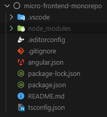
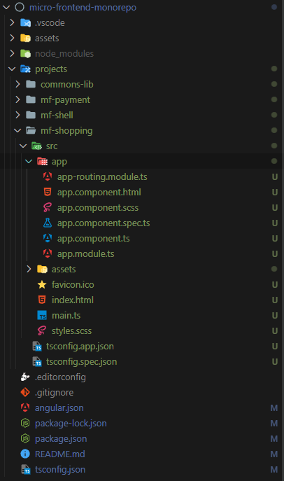
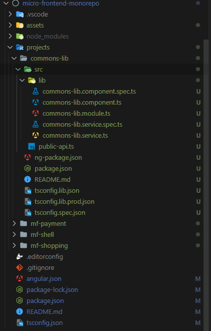
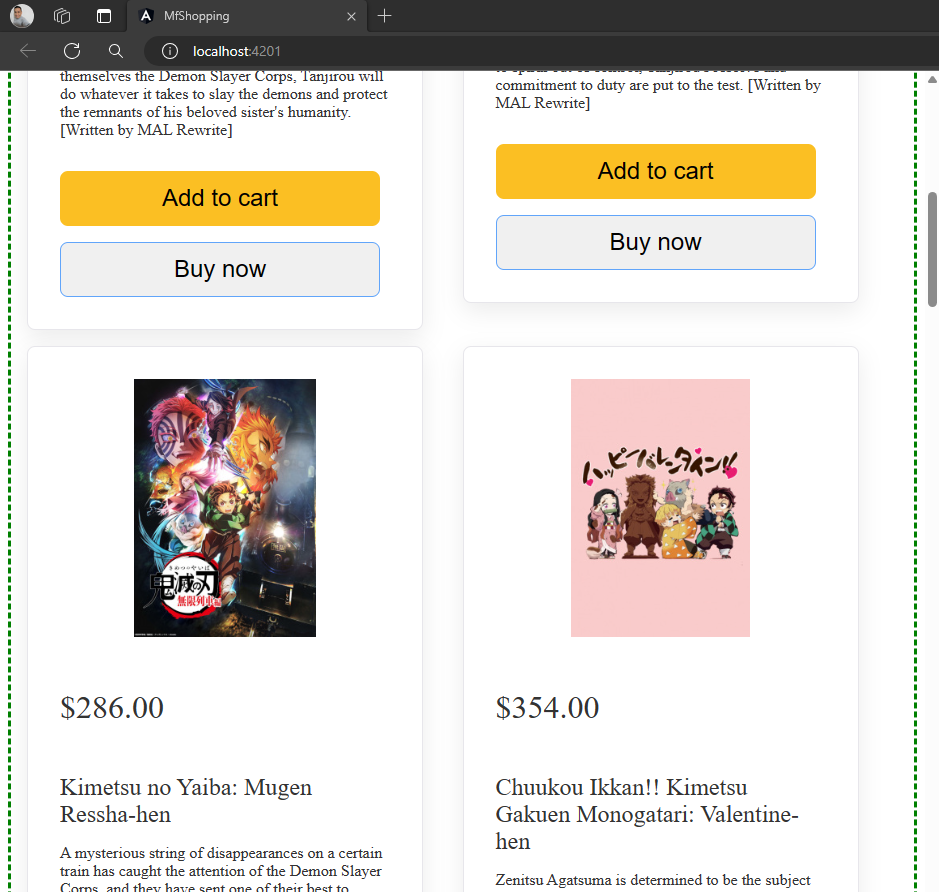
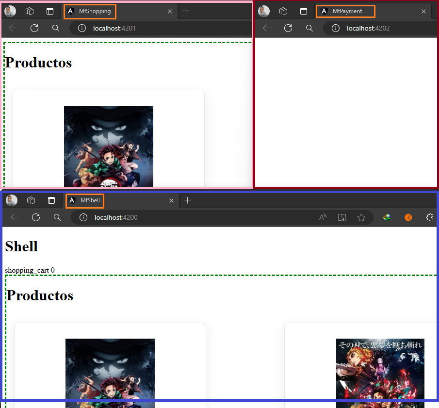
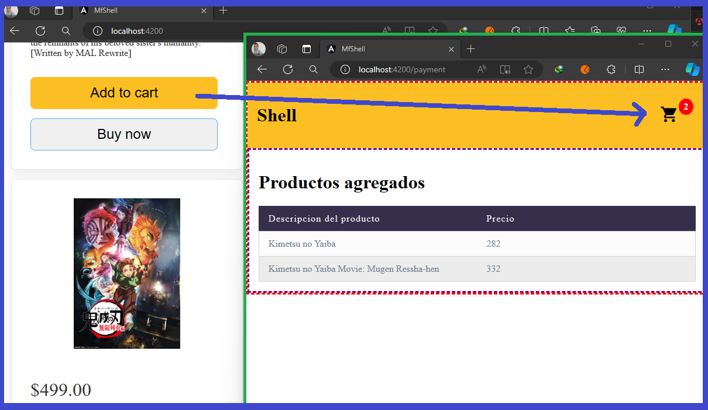

# [MICRO - FRONTEND con Angular y Module Federation](https://www.youtube.com/watch?v=12x2QpDCsfk&t=794s)

Tutorial tomado del canal de **youtube LogiDev**

---

## Características del proyecto

- Angular 15.2.10
- Node 18.16.0


## Creando espacio de trabajo

Para trabajar con una arquitectura monorepo en Angular, **primero debemos crear nuestro espacio de trabajo** utilizando el siguiente comando.

```bash
$ ng new micro-frontend-monorepo --create-application=false
```

**NOTA**

`--create-application=false`, con esta bandera le decimos a la CLI que no queremos que nos cree la carpeta `/src`, ni tampoco los archivos `karma.config.js`, etc., es decir, **únicamente queremos que nos cree un espacio de trabajo.**

A continuación de muestra los archivos y directorios creados en nuestro espacio de trabajo luego de haber ejecutado el comando anterior:



Las dependencias del `package.json`:

```json
"dependencies": {
    "@angular/animations": "^15.1.0",
    "@angular/common": "^15.1.0",
    "@angular/compiler": "^15.1.0",
    "@angular/core": "^15.1.0",
    "@angular/forms": "^15.1.0",
    "@angular/platform-browser": "^15.1.0",
    "@angular/platform-browser-dynamic": "^15.1.0",
    "@angular/router": "^15.1.0",
    "rxjs": "~7.8.0",
    "tslib": "^2.3.0",
    "zone.js": "~0.12.0"
},
"devDependencies": {
    "@angular/cli": "~15.1.1",
    "@angular/compiler-cli": "^15.1.0",
    "@types/jasmine": "~4.3.0",
    "jasmine-core": "~4.5.0",
    "karma": "~6.4.0",
    "karma-chrome-launcher": "~3.1.0",
    "karma-coverage": "~2.2.0",
    "karma-jasmine": "~5.1.0",
    "karma-jasmine-html-reporter": "~2.0.0",
    "typescript": "~4.9.4"
}
```

---

# Creando Micro Frontends y Librería

---

## 1° Micro frontend: mf-shell

En toda arquitectura de micro frontend siempre vamos a tener un proyecto que se encargue de orquestar los demás micro frontend, en este caso, el proyecto `mf-shell` que construiremos a continuación tendrá esa responsabilidad.

Para crear nuestra primera aplicación de micro frontend llamado `mf-shell` ejecutaremos el siguiente comando:

```bash
$ ng g application mf-shell --style=scss --routing=true
```

**NOTA**

- Observar que le estamos indicando qué tipo de hoja de estilo usaremos: `scss`.
- Le indicamos que nos construya el módulo de rutas: `--routing=true`.

## 2° Micro frontend: mf-payment

El segundo proyecto o micro frontend que crearemos se llamará `mf-payment`. En este caso no crearemos las rutas como lo hicimos en el primer micro frontend.

```bash
$ ng g application mf-payment --style=scss
```

## 3° Micro frontend: mf-shopping

Como tercer proyecto o micro frontend crearemos el `mf-shopping`. En este proyecto sí necesitamos el módulo de rutas, es por eso que agregamos la bandera `--routing=true`.

```bash
$ ng g application mf-shopping --style=scss --routing=true
```

## 4° Proyecto librería: commons-lib

Como último proyecto, crearemos el del tipo librería llamado `commons-lib`. Este proyecto de tipo librería lo usaremos para compartir un `service` para que se puedan comunicar cada uno de los micro frontend.

Ahora, también se podría crear un proyecto de tipo librería de Angular donde agreguemos todos los componentes que van a ser utilizados por cada uno de los micro frontends, de esa manera, nuestros componentes tendría una guía de estilos, el mismo estilo de diseños para cada uno de los micro frontends y así, como ese ejemplo podríamos darle más utilidades a un proyecto de librería. **La idea es que nuestros micro frontends también pueden consumir otras librerías realizadas en el mismo framework de Angular.**

```bash
$ ng g library commons-lib
```

Luego de ejecutar todos los comandos en la raíz del espacio de trabajo, la estrucura del proyecto quedaría de esta manera:



En la imagen anterior, estamos desplegando el directorio del micro frontend `mf-shopping` para conocer detalles de su estructura interna.

En la imagen siguiente vemos la estructura del proyecto de librería `commons-lib`:



---

# [Activando Module Federation](https://www.npmjs.com/package/@angular-architects/module-federation)

---

`@angular-architects/module-federation`, es una herramienta que permite la integración de la funcionalidad de `Module Federation` en aplicaciones Angular. `Module Federation` es una característica de Webpack 5 que **facilita la compartición de código entre distintas aplicaciones JavaScript. Permite cargar módulos de manera remota y dinámica en tiempo de ejecución, lo que resulta especialmente útil en entornos de microfrontends y arquitecturas distribuidas.**

`@angular-architects/module-federation` proporciona una capa de abstracción y herramientas específicas para trabajar con `Module Federation` en el contexto de proyectos Angular, simplificando la configuración y el uso de esta funcionalidad dentro de una aplicación Angular.

Al utilizar `@angular-architects/module-federation`, los desarrolladores pueden definir fácilmente qué partes de su aplicación Angular desean compartir y cómo integrarlas con otras aplicaciones que también utilicen Module Federation.

Volviendo a nuestro proyecto, debemos activar el `module federation` a cada proyecto que hemos creado. Para eso necesitamos agrega la siguiente librería a nuestro proyecto:

```bash
$ npm i -D @angular-architects/module-federation@^15.0.0
```

**NOTA**

> Observar, que como estamos usando Angular 15, en la instalación del angular-architects especificamos la versión que será compatible con nuestra vesión de Angular.

## Agregando Module Federation: mf-shell

Una vez que hemos instalado la librería `@angular-architects/module-federation`, nos toca agregar el `module federation` a cada proyecto creado inicialmente. 

En este caso lo agregaremos al proyecto `mf-shell` utilizando el siguiente comando:

```bash
$ ng add @angular-architects/module-federation@^15.0.0 --project mf-shell --port 4200 --type host

Skipping installation: Package already installed
CREATE projects/mf-shell/webpack.prod.config.js (46 bytes)
CREATE projects/mf-shell/webpack.config.js (413 bytes)
CREATE projects/mf-shell/src/bootstrap.ts (214 bytes)
UPDATE tsconfig.json (903 bytes)
UPDATE projects/mf-shell/tsconfig.app.json (217 bytes)
UPDATE angular.json (8678 bytes)
UPDATE package.json (1273 bytes)
UPDATE projects/mf-shell/src/main.ts (58 bytes)
√ Packages installed successfully.
```

**DONDE**

- `--project`, seleccionamos el proyecto al que aplicaremos esta configuración.
- `--type`, le decimos qué tipo de micro frontend va a ser. En este caso, este será un micro frontend del tipo `host`.
- `--port`, le decimos que este micro frontend correrá en el puerto 4200.

Luego de que se ejecuta el comando anterior, se nos creará varios archivos, uno de ellos es el `webpack.config.js`.

En el archivo `webpack.config.js` observamos el siguiente código que se crea por defecto:

```javascript
const { shareAll, withModuleFederationPlugin } = require('@angular-architects/module-federation/webpack');

module.exports = withModuleFederationPlugin({

  remotes: {
    "mfPayment": "http://localhost:4200/remoteEntry.js",
    "mfShopping": "http://localhost:4200/remoteEntry.js",
  },

  shared: {
    ...shareAll({ singleton: true, strictVersion: true, requiredVersion: 'auto' }),
  },

});
```

- En el objeto `remotes` se agregan los micro frontends que se van a integrar, en este caso, al proyecto host `mf-shell`, ya que ahí está ese archivo.
Es importante notar que micro frontends fueron agregados de manera automática cuando agregamos el `module federation` al `mf-shell`.

- En el objeto `shared` se colocan todo aquello que se va a compartir. Por ejemplo, compartirá el `package.json` del proyecto con todos los micro frontends para que trabajen con la misma versión de librerías.

## Agregando Module Federation: mf-shopping

Agregamos el module federation al micro frontend **mf-shopping**. Es importante notar que dentro de las banderas utilizadas estamos diciéndole que es del `--type remote`. 

Es `remote` porque este micro frontend será integrada dentro de la aplicación `host`, es decir, dentro del micro frontend `mf-shell`.

Si observamos el `mf-shell` veremos que en el archivo `webpack.config.js` el objeto `remotes` y dentro de ese objeto está siendo llamado nuestro micro frontend `mf-shopping`, por esa razón es que este micro frontend debe ser remoto, incluso le hemos colocado el puerto `4201` desde donde será llamado. Observemos la modificación que le hicimos al `webpack.config.js` del `mf-shell`:

```js
remotes: {
    ...
    "mfShopping": "http://localhost:4201/remoteEntry.js",
},
```

Observar que, como agregaremos el module federation al mf-shopping con puerto 4201, ese mismo puerto debe verse reflejado en el archivo `webpack.config.js` del `mf-shell`.

Ahora sí, ejecutamos el comando siguiente para agregar el module federation al micro frontend **mf-shopping**:

```bash
$ ng add @angular-architects/module-federation@^15.0.0 --project mf-shopping --port 4201 --type remote

Skipping installation: Package already installed
CREATE projects/mf-shopping/webpack.prod.config.js (46 bytes)
CREATE projects/mf-shopping/webpack.config.js (389 bytes)
CREATE projects/mf-shopping/src/bootstrap.ts (214 bytes)
UPDATE tsconfig.json (903 bytes)
UPDATE projects/mf-shopping/tsconfig.app.json (217 bytes)
UPDATE angular.json (9113 bytes)
UPDATE package.json (1273 bytes)
UPDATE projects/mf-shopping/src/main.ts (58 bytes)
√ Packages installed successfully.
```

Luego de que se ejecuta el comando anterior, se nos creará varios archivos, uno de ellos es el `webpack.config.js`.

En el archivo `webpack.config.js` observamos el siguiente código que se crea por defecto:

```javascript
const { shareAll, withModuleFederationPlugin } = require('@angular-architects/module-federation/webpack');

module.exports = withModuleFederationPlugin({

  name: 'mf-shopping',

  exposes: {
    './Component': './projects/mf-shopping/src/app/app.component.ts',
  },

  shared: {
    ...shareAll({ singleton: true, strictVersion: true, requiredVersion: 'auto' }),
  },

});
```
Observemos que como este micro frontend es del `type remote` el contenido del archivo `webpack.config.js` es algo distinto al contenido del micro frontend del tipo `host`.

**DONDE**

- `name`, propiedad donde se le asigna un nombre a nuestro micro frontend. En nuestro caso lo puso tal cual se llama el proyecto `mf-shopping`.
- `expose`, aquí deben ir los elementos o módulos que queremos que se compartan. Por defecto nos da el ejemplo que dice, sabes qué comparteme este componente `./projects/mf-shopping/src/app/app.component.ts`,
  pero, lo que en realidad debemos compartir son `módulos` dado que estamos usando `Module Federation`, precisamente para compartir `módulos` y no componentes.

**NOTA**
> `Module federation` sirve para compartir **módulos**, por eso se llama federación de **módulos**, lo que vamos a compartir son **módulos**, entonces  en el `expose` lo que debemos exponer en realidad son módulos.


## Agregando Module Federation: mf-payment

Agregamos el module federation al micro frontend **mf-payment**. Es importante notar que dentro de las banderas utilizadas estamos diciéndole que es del `--type remote`. 

Es `remote` porque este micro frontend será integrada dentro de la aplicación `host`, es decir, dentro del micro frontend `mf-shell`.

Si observamos el `mf-shell` veremos que en el archivo `webpack.config.js` el objeto `remotes` y dentro de ese objeto está siendo llamado nuestro micro frontend `mf-payment`, por esa razón es que este micro frontend debe ser remoto, incluso le hemos colocado el puerto `4202` desde donde será llamado.

Veamos que hasta este punto el objeto `remotes` del archivo `webpack.config.js` ya tiene configurado los puertos para sus correspondientes micro frontends:

```js
remotes: {
    "mfPayment": "http://localhost:4202/remoteEntry.js",
    "mfShopping": "http://localhost:4201/remoteEntry.js",
},
```

Listo, ahora que configuramos el puerto del mf-payment en el archivo del mf-shell, es momento de agregar el module federation al mf-payment:

```bash
$ ng add @angular-architects/module-federation@^15.0.0 --project mf-payment --port 4202 --type remote

Skipping installation: Package already installed
CREATE projects/mf-payment/webpack.prod.config.js (46 bytes)
CREATE projects/mf-payment/webpack.config.js (387 bytes)
CREATE projects/mf-payment/src/bootstrap.ts (214 bytes)
UPDATE tsconfig.json (903 bytes)
UPDATE projects/mf-payment/tsconfig.app.json (217 bytes)
UPDATE angular.json (9543 bytes)
UPDATE package.json (1273 bytes)
UPDATE projects/mf-payment/src/main.ts (58 bytes)
√ Packages installed successfully.
```

---

# Agregando funcionalidad a proyectos

---

## Listando productos: mf-shopping

En este apartado vamos a listar los productos que nos retorna el endpoint que vamos a consumir. 

### Modelos 

Para eso crearemos nuestros modelos `anime-api.interface.ts` y `product-card.interface.ts`:

```typescript

export interface IResponseAnime {
  pagination: Pagination;
  data: Datum[];
}

interface Datum {...}
interface Producer {...}
interface Broadcast {...}
interface Aired {...}
interface Prop {...}
interface From {...}
interface Trailer {...}
interface Images2 {...}
interface Images {...}
interface Jpg {...}
interface Pagination {...}
interface Items {...}
```

```typescript
export interface IProductCard {
  urlImage: string;
  price: number;
  name: string;
  description: string;
}
```

### Módulo

Creamos el módulo `products.module.ts` que contendrá los componentes que crearemos posteriormente:

```typescript
const routes: Routes = [
  { path: '', component: ProductsComponent }
];

@NgModule({
  declarations: [ProductsComponent],
  imports: [
    RouterModule.forChild(routes),
    CommonModule,
    ProductCardComponent,
  ],
})
export class ProductsModule {}
```

Observar que crearemos un componente llamado `ProductCardComponent` que será del tipo `Stand Alone Component`, por esa razón es que está en la sección de `imports`, mientras
que en la sección de `declarations` está el componente `ProductsComponent` que no es del tipo standalone component, sino un componente normal.

### Componentes

El primer componente a crear será el `ProductCardComponent` de tipo `standalone component`:

```typescript
@Component({
  selector: 'app-product-card',
  standalone: true,
  templateUrl: './product-card.component.html',
  styleUrls: ['./product-card.component.scss'],
  imports: [CommonModule]
})
export class ProductCardComponent {

  @Input() product?: IProductCard;

  clickCard(): void {
    console.log('clickCard()');
  }

}
```

Su componente en html sería el siguiente:

```html
<div class="card" *ngIf="product">
  <div class="card-image">
    
  </div>

  <p class="card__price">{{ product.price | currency }}</p>

  <div class="card-description">
    <label class="card-description__title">{{ product.name }} </label>
    <p class="card-description__description">
      {{ product.description }}
    </p>
  </div>

  <button class="card__add" (click)="clickCard()">Add to cart</button>
  <button class="card__buy">Buy now</button>
</div>
```

Como segundo componente, crearemos el component `products`:

```typescript

@Component({
  selector: 'app-products',
  templateUrl: './products.component.html',
  styleUrls: ['./products.component.scss']
})
export class ProductsComponent implements OnInit {

  public products: IProductCard[] = [];

  constructor(private _animeService: AnimeService) { }

  ngOnInit(): void {
    this._animeService.getAnimes()
      .subscribe(response => {
        this.products = response;
      });
  }

}
```

El elemento html de este componente sería: 

```html
<div class="app">
  <h1>Productos</h1>

  <div class="container">
    <app-product-card *ngFor="let product of products" [product]="product"></app-product-card>
  </div>
</div>
```

### Servicio

El componente `products` está consumiendo el servicio `AnimeService`. A continuación crearemos dicho servicio:

```typescript
@Injectable({
  providedIn: 'root'
})
export class AnimeService {

  constructor(private _httpClient: HttpClient) { }

  public getAnimes(): Observable<IProductCard[]> {
    return this._httpClient.get<IResponseAnime>(`https://api.jikan.moe/v4/anime?q=kimetsu&sfw`)
      .pipe(
        map(response => {
          return response.data
            .filter(item => item.synopsis)
            .map<IProductCard>(item => ({
              urlImage: item.images.jpg.image_url,
              price: this._getNumberRandom(),
              name: item.title,
              description: item.synopsis!
            }))
        })
      );
  }

  private _getNumberRandom() {
    return Math.floor(Math.random() * (500 - 1 + 1) + 1);
  }
}
```

### Routing Module

Configuramos la ruta donde levantaremos la aplicación:

```typescript
const routes: Routes = [
  {
    path: '',
    loadChildren: () => import('./products/products.module').then(m => m.ProductsModule),
  }
];

@NgModule({
  imports: [RouterModule.forRoot(routes)],
  exports: [RouterModule]
})
export class AppRoutingModule { }
```

### Ejecutando micro frontend mf-shopping

Levantamos el micro frontend `mf-shopping` ejecutando el siguiente comando desde la raíz del proyecto (área de trabajo):

```bash
M:\PROGRAMACION\DESARROLLO_ANGULAR\09.youtube_logi_dev\04.micro-frontend\micro-frontend-monorepo (main -> origin)
$ ng serve mf-shopping -o
```

Como configuramos el `mf-shopping` para que se ejecute en el puerto `4201` entonces se abrirá automáticamente gracias a la bandera `-o`.



## Configurando canal de comunicación: commons-lib

Para comunicarnos con un micro frontend podemos usar los `custom event` o símplemente lo que Angular ya nos ofrece: los `service`.

Lo primero que debemos hacer es agregar la dependencia de `rxjs` en el `package.json` de la librería. La versión de esta dependencia la podemos obtener del `package.json` del proyecto principal (área de trabajo).

```json
{
  "name": "commons-lib",
  "version": "0.0.1",
  "peerDependencies": {
    "@angular/common": "^15.1.0",
    "@angular/core": "^15.1.0"
  },
  "dependencies": {
    "tslib": "^2.3.0",
    "rxjs": "~7.8.0"
  },
  "sideEffects": false
}
```

Luego que hemos agregado la dependencia en el `package.json` de la librería, ejecutamos el siguiente comando para hacer la instalación. 
Notar que estamos posicionados justo en la raíz del proyecto de librería `/commons-lib`:

```bash
M:\PROGRAMACION\DESARROLLO_ANGULAR\09.youtube_logi_dev\04.micro-frontend\micro-frontend-monorepo\projects\commons-lib (main -> origin) (commons-lib@0.0.1)
$ npm install
```

Recordemos que la librería es un proyecto a parte, por eso es una librería. Por lo tanto, para hacer uso de la librería, nosotros debemos compilar la librería y recién en ese momento podremos hacer referencia a los compilados de la librería desde los micro frontends. 

Para solucionar el inconveniente mencionado anteriormente, la comunidad de `Angular Architect` **nos dan una solución para poder integrar o hacer referencia a proyectos de tipo librería.**
Para eso debemos realizar la siguiente configuración en el archivo `tsconfig.json` del proyecto principal (área de trabajo):

```json
{
  "compileOnSave": false,
  "compilerOptions": {
    "baseUrl": "./",
    "paths": {
      "@commons-lib": [
        "projects/commons-lib/src/public-api.ts"
      ]
    },
    ...
  },
  "angularCompilerOptions": {
    ...
  }
}
```

- `"@commons-lib"`, agregamos el `@` para poder hacer uso del `@commons-lib` en lugar de escribir toda la ruta del arreglo.
- `"projects/commons-lib/src/public-api.ts"`, es la ruta del archivo que se encargará de exponer todos los elementos que serán utilizados por los otros proyectos.

Ahora, si abrimos el archivo `public-api.ts` veremos que por defecto se están exponiendo los siguientes archivos o paths:

```typescript
/*
 * Public API Surface of commons-lib
 */

export * from './lib/commons-lib.service';
export * from './lib/commons-lib.component';
export * from './lib/commons-lib.module';
```

## Agregando funcionalidad a librería: commons-lib

En el proyecto de librería `commons-lib` agregaremos una funcionalidad. Para eso aprovecharemos que por defecto angular nos ha creado el archivo `commons-lib.service` para poder implementarlo y quien está siendo expuesto en el archivo `public-api.ts`:

```typescript
@Injectable({
  providedIn: 'root'
})
export class CommonsLibService {

  private _products: ICommonProduct[] = [];
  private _channelSource = new BehaviorSubject<number>(0);

  public channelPayment$ = this._channelSource.asObservable();

  sendData(product: ICommonProduct): void {
    this._products.push(product);
    localStorage.setItem('products', JSON.stringify(this._products));
    this._channelSource.next(this._products.length);
  }
}
```
```typescript
export interface ICommonProduct {
  price: number;
  name: string;
}
```

De esta forma, cuando se agregue un producto, lo guardaremos en el `localStorage` y como hemos creado un `BehaviorSubject`, quienes se subscriban a ese observable serán notificados con el número de elementos que se han agregado.

## Agregando funcionalidad al mf-shopping

Habiendo configurado nuestro proyecto de librería, es hora de utilizarlo en nuestro micro frontend `mf-shopping`. Para eso nos iremos al componente `ProductCardComponent` y agregaremos la siguiente funcionalidad.

```typescript
@Component({
  selector: 'app-product-card',
  standalone: true,
  templateUrl: './product-card.component.html',
  styleUrls: ['./product-card.component.scss'],
  imports: [CommonModule]
})
export class ProductCardComponent {

  @Input() product?: IProductCard;

  constructor(private _commonsLibService: CommonsLibService) { }

  clickCard(): void {
    this._commonsLibService.sendData({
      name: this.product!.name,
      price: this.product!.price
    });
  }
}
```

Notar que estamos inyectando por constructor el `CommonsLibService` que viene del path `@commons-lib` que definimos en el archivo `tsconfig.json`.

### Exponiendo nuestro micro frontend: mf-shopping

Para que otros proyectos puedan usar nuestro micro frontend, necesitamos exportarlo, en este caso, exportaremos únicamente el módulo `ProductModule`.


En el archivo `webpack.config.js` del micro frontend `mf-shopping` realizamos las siguientes configuraciones:

```js
const { shareAll, withModuleFederationPlugin, SharedMappings } = require('@angular-architects/module-federation/webpack');

module.exports = withModuleFederationPlugin({

  //* Le definimos un nombre a este micro frontend
  name: 'mfShopping',

  //* De este micro frontend vamos a exponer este módulo de productos. 
  //* Este módulo será utilizable para los demás micro frontends
  exposes: {
    './ProductModule': './projects/mf-shopping/src/app/products/products.module.ts',
  },

  shared: {
    ...shareAll({ singleton: true, strictVersion: true, requiredVersion: 'auto' }),
  },

  //* "@commons-lib", alias de las librerías que se utilzará en cada microfrontend. Por detrás, 
  //* la librería Angular Architect va a generar la instancia de la descarga y la
  //* va a inyectar a cada uno de los microfrontend. De esa manera es más limpio 
  //* interactuar con librerías en un proyecto de Angular
  sharedMappings: ["@commons-lib"] 
});
```

## Configurando e implementando mf-shell

Primero agregaremos el microfrontend para usarlo en el `mf-shell`, para eso simplemente
vamos al archivo `webpack.config.js` y configuramos el objeto `remotes`:

```js
const { shareAll, withModuleFederationPlugin } = require('@angular-architects/module-federation/webpack');

module.exports = withModuleFederationPlugin({

  remotes: {
    "mfShopping": "http://localhost:4201/remoteEntry.js",
  },

  shared: {
    ...shareAll({ singleton: true, strictVersion: true, requiredVersion: 'auto' }),
  },

  //* Para poder utilizar dentro de nuestro mf-shell lo exportado en la librería
  sharedMappings: ['@commons-lib']
});
```

Notar que inicialmente ya lo teníamos configurado, aquí solamente estamos dejando en el objeto `remotes` la url donde correrá el micro frontend `mf-shopping`. Notar, además que
estamos definiendo el nombre que le pusimos a dicho micro frontend `mfShopping`.

### Configurando ruta 

En el modulo `app-routing.module.ts` crearemos las rutas de nuestra aplicación. Uitlizaremos para eso `LazyLoad` quién importará módulos de los microfrontends. 

Como estos micro frontend están en otra ubicación, al hacer el `import('...')` typescript nos va a marcar un error, así que para solucionarlo debemos agregar el archivo `custom.d.ts` en el `mf-shell/app/` con el siguiente código:

```typescript
/**
 * * Le decimos a TypeScript que van a existir módulos que
 * * empezarán con mfShopping o mfPayment, y lo que
 * * venga por delante de ellos (/*) que los reconozca.
 */

declare module 'mfShopping/*';
declare module 'mfPayment/*';
```
Ahora sí, podemos configurar nuestras rutas:

```typescript
//* Para que no nos marque error en la ruta de improtación,
//* es que agregamos el archivo custom.d.ts con cierta configuración.
const routes: Routes = [
  //* Primer microfrontend
  {
    path: '',
    loadChildren: () => import('mfShopping/ProductModule').then(m => m.ProductsModule),
  },
  //* Segundo microfrontend
  {
    path: 'payment',
    loadComponent: () => import('mfPayment/PaymentComponent').then(c => c.PaymentComponent),
  }
];

@NgModule({
  imports: [RouterModule.forRoot(routes)],
  exports: [RouterModule]
})
export class AppRoutingModule { }
```

Si alguien va al path '', cargará el micro front end `ProductModule` y si alguien va al path `payment` se cargará el micro frontend `PaymentComponent`.

Es importante ver que cuando usamos el módulo `ProductModule` estamos usando el `loadChildren`, mientras que si usamos un componente del tipo standalone `PaymentComponent` debemos usar el `loadComponent`.

Como dato adicional, si vamos al microfrontend `ProductModule`, este está haciendo uso de la librería `HttpClientModule`, así que cuando lo usemos en el micro frontend contenedor `mf-shell` debemos e importarlo en su módulo `app.modules.ts` sino nos mostrará el error típico de que se requiere dicho módulo:

Del microfrontend `mf-shell`:

```typescript
@NgModule({
  declarations: [
    AppComponent
  ],
  imports: [
    BrowserModule,
    AppRoutingModule,
    HttpClientModule,
  ],
  providers: [],
  bootstrap: [AppComponent]
})
export class AppModule { }
```

### Implementando vista

En el `app.component.ts` del `mf-shell` inyectamos el `CommonsLibService`, desde donde llamaremos al observable `channelPayment$` definido en el servicio `CommonsLibService`:

```typescript
@Component({
  selector: 'app-root',
  templateUrl: './app.component.html',
  styleUrls: ['./app.component.scss']
})
export class AppComponent {

  constructor(public commonsLibService: CommonsLibService) { }

}
```
```html
<div class="container">
  <h1 routerLink="/">Shell</h1>
  <div class="cart" routerLink="/payment">
    <span class="material-icons"> shopping_cart </span>
    <span class="cart__count">
      {{ commonsLibService.channelPayment$ | async }}
    </span>
  </div>
</div>
<router-outlet></router-outlet>
```

## Configura e implementa el micro frontend: mf-payment

En el `app.module` agregamos el componente de tipo stand alone:

```typescript
@NgModule({
  declarations: [
    AppComponent
  ],
  imports: [
    BrowserModule,
    PaymentComponent
  ],
  providers: [],
  bootstrap: [AppComponent]
})
export class AppModule { }
```

### Implementa componente

Antes de implementar el componente de `PaymentComponent` debemos ir al archivo `public-api.ts` de la librería `commons-lib` y exportar el archivo `product.interface` que contiene el modelo `ICommonProduct` dado que será usado en este micro frontend:

```typescript
/*
 * Public API Surface of commons-lib
 */

export * from './lib/commons-lib.service';
export * from './lib/commons-lib.component';
export * from './lib/commons-lib.module';
export * from './lib/models/product.interface';
```
Ahora sí, podemos implementar el componente `payment.component`:

```typescript
@Component({
  selector: 'app-payment',
  templateUrl: './payment.component.html',
  styleUrls: ['./payment.component.scss'],
  standalone: true,
  imports: [CommonModule]
})
export class PaymentComponent implements OnInit {

  public products: ICommonProduct[] = [];

  ngOnInit(): void {
    const productsStorage = localStorage.getItem('products');
    console.log(productsStorage);

    if (productsStorage) {
      this.products = JSON.parse(productsStorage) as ICommonProduct[];
    }
  }

}
```
```html
<div class="container">
    <h1>Productos agregados</h1>

    <table>
        <thead>
            <tr>
                <th>Descripcion del producto</th>
                <th>Precio</th>
            </tr>
        </thead>
        <tbody>
            <tr *ngFor="let item of products">
                <td data-label="Projeto">{{ item.name }}</td>
                <td data-label="Projeto">{{ item.price }}</td>
            </tr>
        </tbody>
    </table>
</div>
```
### Configura el webpack.config.js del mf-payment

Al igual que hicimos con la configuración del `mf-shopping`, aquí haremos algo similar:

```javascript
module.exports = withModuleFederationPlugin({

  //* Definimos el nombre con el que será utilizado este micro frontend
  name: 'mfPayment',

  //* Estamos compartiendo un PaymentComponent, pero ese es un componente del tipo StandAlone,
  //* es decir, por debajo es un módulo en sí mismo.
  exposes: {
    './PaymentComponent': './projects/mf-payment/src/app/payment/payment.component.ts',
  },

  shared: {
    ...shareAll({ singleton: true, strictVersion: true, requiredVersion: 'auto' }),
  },

  //* Recordar, que como estamos usando la librería en este micro frontend,
  //* debemos usar la opción sharedMapping y colocar el alias @commons-lib
  sharedMappings: ["@commons-lib"],
});
```

### Configura el webpack.config.js del mf-shell

En el `webpack` del microfrontend contenedor (principal), debemos agregare en el objeto `remotes` el micro frontend de `payment`, así que lo que haremos será sencillamente agregarle la ruta  con el puerto que le definimos, en este caso el puerto `4202`:

```typescript
module.exports = withModuleFederationPlugin({

  remotes: {
    "mfShopping": "http://localhost:4201/remoteEntry.js",
    "mfPayment": "http://localhost:4202/remoteEntry.js",
  },

  shared: {
    ...shareAll({ singleton: true, strictVersion: true, requiredVersion: 'auto' }),
  },

  //* Para poder utilizar dentro de nuestro mf-shell lo exportado en la librería
  sharedMappings: ['@commons-lib']
});
```

---

# Desplegando micro frontends

---

Ubicados en la raíz del proyecto (área de trabajo) ejecutamos cada uno de los microfrontends:

```bash
M:\PROGRAMACION\DESARROLLO_ANGULAR\09.youtube_logi_dev\04.micro-frontend\micro-frontend-monorepo (main -> origin)

$ ng serve mf-shopping -o

$ ng serve mf-payment -o

$ ng serve mf-shell -o
```

Luego, de ejecutar los comandos, veremos que nuestros microservicios están desplegados en su correspondiente puerto:



Como observamos, en el `mf-shell`, que es el micro frontend contenedor (espacio de trabajo) está desplegándose nuestro otro microfrontend `mf-shopping`, tal como lo teníamos previsto.

Finalmente, podemos observar que nuestro microfrontend payment también está funcionando:



**NOTA**

> Como estamos usando el `localStorage`, si refrescamos la página de payment, veremos que el valor del carrito estará siempre en 0, dado que cuando agregamos algún producto al carrito, este producto se agrega al localStorage del mf-shell, a su dominio, mientras que si abrimos un nuevo navegador y accedemos a la ruta del mf-payment, este no lo va a encontrar ya que está corriendo en otro dominio, en este caso en otro pruerto.
>
> Solo dejo este comentario como nota, para saber el por qúe cuando lo abrimos con el puerto del propio mf-payment, no veremos ningún producto.
